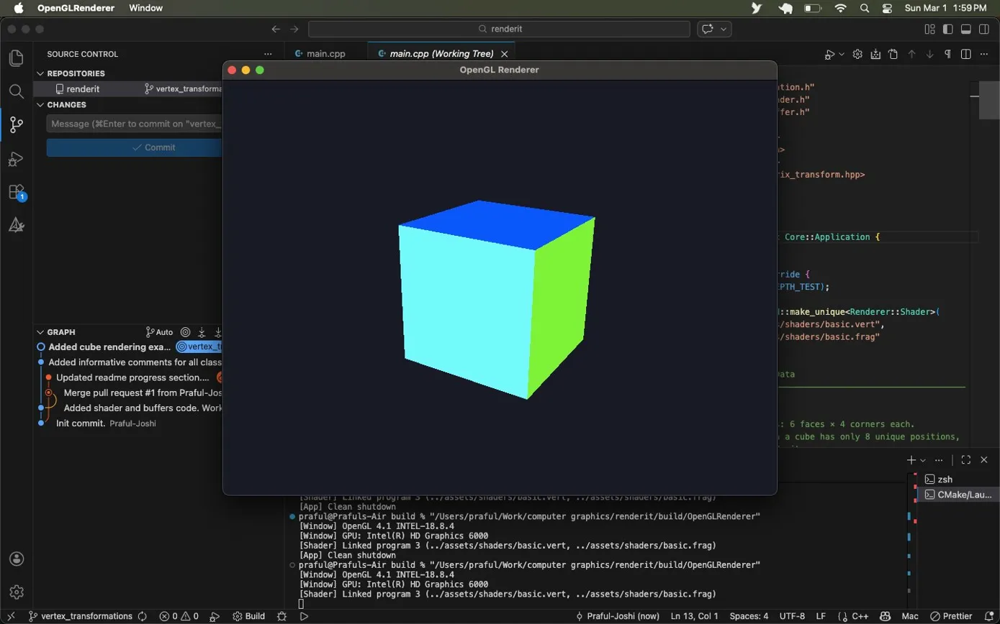
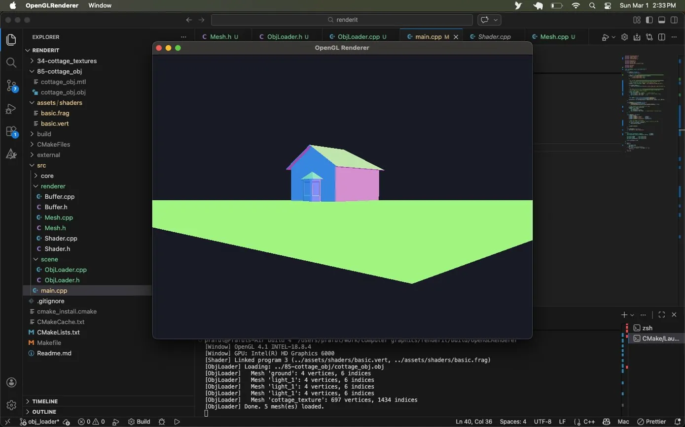
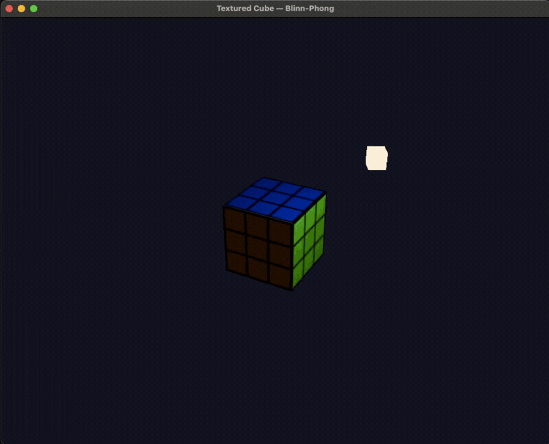
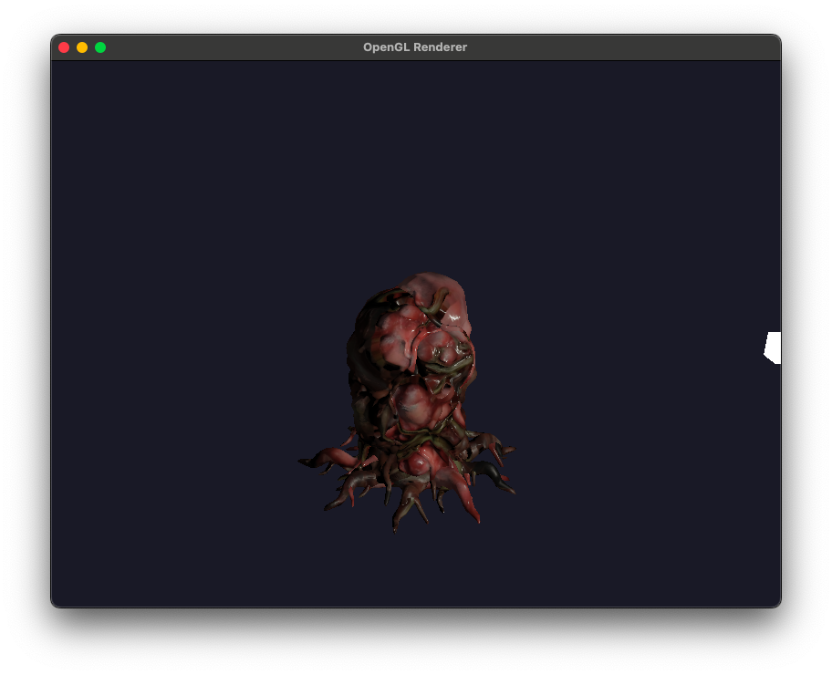
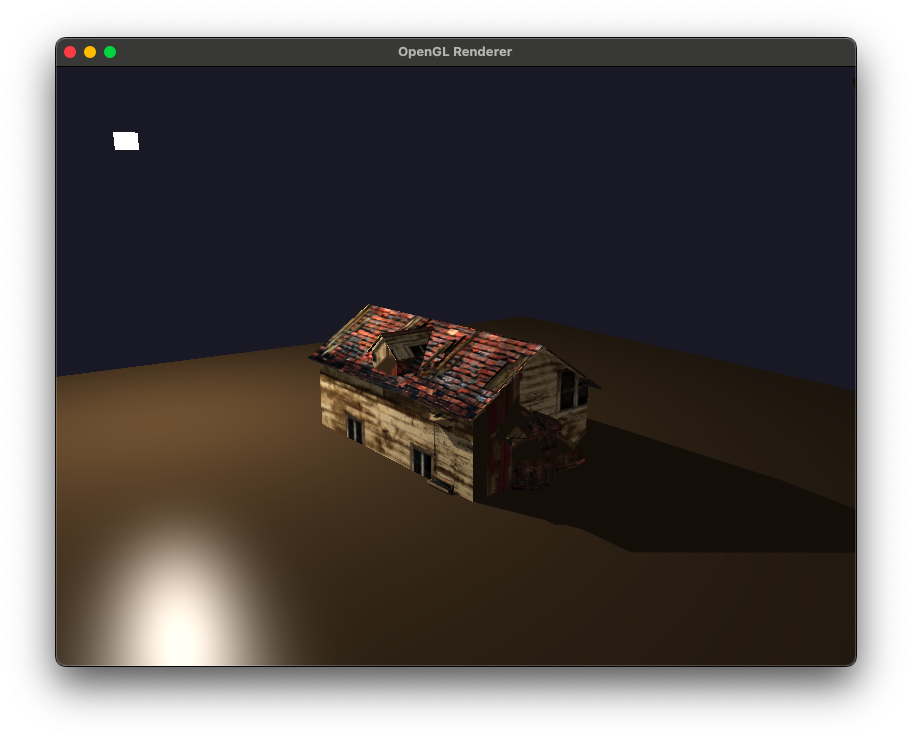

# Renderit: An OpenGL Renderer

A progressive, from-scratch 3D rendering engine built in C++ and OpenGL — designed to learn and implement the full spectrum of real-time computer graphics, from fundamental geometry to physically based rendering.

The goal is not just a working renderer but a professional, modular codebase that demonstrates mastery of every layer of the graphics pipeline.

---

## Roadmap

- [x] **Step 1** — Window/Application architecture (GLFW, GLAD, core engine loop)
- [x] **Step 2** — First cube: VAOs, VBOs, vertex and fragment shaders <p align="center">  </p>
- [x] **Step 3** — Assimp model loader + material system <p align="center">  </p>
- [x] **Step 4** — Texturing: UVs, stb_image, texture units <p align="center">  </p>
- [x] **Step 5** — Blinn-Phong lighting: normals, diffuse, specular, ambient <p align="center">  </p> <p align="center">  </p>
- [x] **Step 6** — Normal mapping (TBN matrix, tangent space)
- [x] **Step 7** — PBR shading: Cook-Torrance BRDF, metallic/roughness workflow <p align="center">  </p>
- [x] **Step 8** — Shadow mapping <p align="center">  </p>
- [ ] **Step 9** — Framebuffers: HDR, bloom, post-processing stack

---

## Concepts Covered

**Core Pipeline**
The transformation pipeline from model space through world, view, clip, and screen space. The MVP matrix. Perspective vs orthographic projection. The depth buffer and Z-fighting.

**GPU Programming**
How vertex and fragment shaders execute on the GPU. GLSL. How buffer objects (VAO/VBO/EBO) move data from CPU RAM to GPU VRAM. The programmable vs fixed-function pipeline.

**Lighting & Materials**
Phong and Blinn-Phong shading models. Normal mapping and tangent space. Physically Based Rendering — the reflectance equation, Cook-Torrance BRDF, metallic/roughness textures, image-based lighting.

**Advanced Rendering**
Framebuffer objects. Shadow mapping. HDR and tone mapping. Bloom and post-processing.

---

## Architecture

```
src/
├── core/
│   ├── Window.h/cpp          GLFW window and OpenGL context ownership
│   └── Application.h/cpp     Main loop, deltaTime, virtual lifecycle hooks
├── renderer/
│   ├── Shader.h/cpp          GLSL compile/link, uniform helpers
│   ├── Buffer.h/cpp          VAO/VBO/EBO abstractions
│   ├── Texture.h/cpp         Image loading and GPU upload
│   ├── Mesh.h/cpp            Single drawable geometry unit
│   ├── Model.h/cpp           Mesh collection + materials
│   └── Renderer.h/cpp        Draw call submission, GL state management
├── scene/
│   ├── Camera.h/cpp          View matrix, frustum, FPS controls
│   ├── Light.h/cpp           Light types and properties
│   └── Scene.h/cpp           Scene graph
├── resources/
│   └── ResourceManager.h/cpp Path-keyed cache for textures and models
└── main.cpp                  Entry point — instantiates application subclass
```

The architecture separates **stable engine infrastructure** (Application, Window, Renderer) from **unstable scene content** (what to load, what to draw). New projects subclass `Application` without touching engine code. Designed to accommodate a parallel asset loading system (thread pool in ResourceManager) without architectural changes.

---

## Dependencies

| Dependency | Purpose | Install |
|---|---|---|
| OpenGL 3.3 | Graphics API | Ships with macOS |
| GLFW | Window creation, input | `brew install glfw` |
| GLAD | OpenGL function loader | Generated at [glad.dav1d.de](https://glad.dav1d.de) |
| GLM | Math (vectors, matrices) | `brew install glm` |
| stb_image | Texture loading | Single header, vendored |
| Assimp | Model loading (Step 6+) | `brew install assimp` |

**Platform:** macOS (OpenGL 4.1 Core Profile max). Targets OpenGL 3.3 Core for broad compatibility.

---

## Building

Requires CMake 3.20+, Clang, and the dependencies above. Put the generated GLAD folder inside root/external directory.

```bash
git clone https://github.com/YOUR_USERNAME/YOUR_REPO.git
cd YOUR_REPO
mkdir build && cd build
cmake ..
make
./OpenGLRenderer
```

**Controls (current):** `Escape` — close window

---

## References

- [learnopengl.com](https://learnopengl.com) — Joey de Vries
- [Real-Time Rendering, 4th Ed.](https://www.realtimerendering.com) — Akenine-Möller et al.
- [Physically Based Rendering](https://www.pbr-book.org) — Pharr, Jakob, Humphreys
