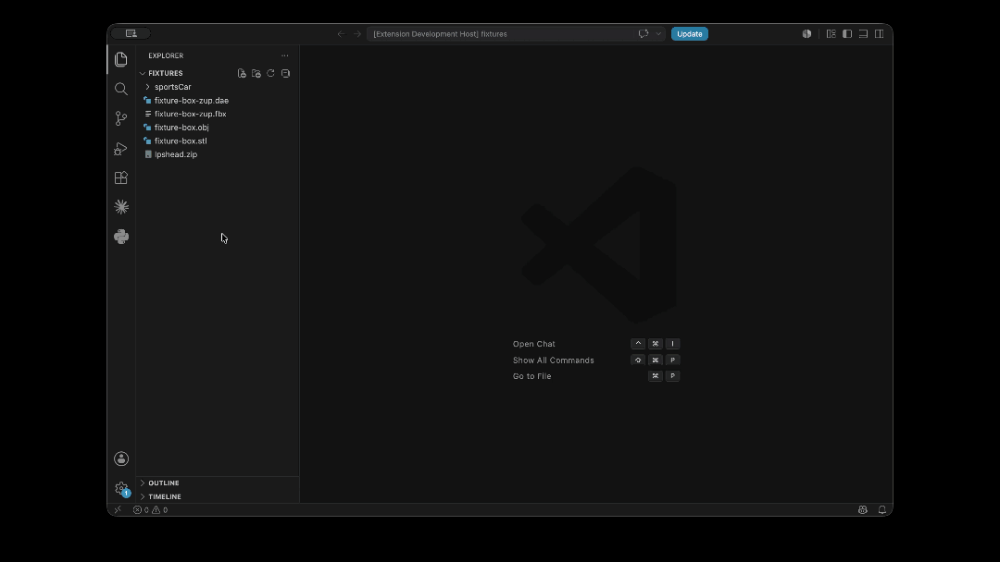
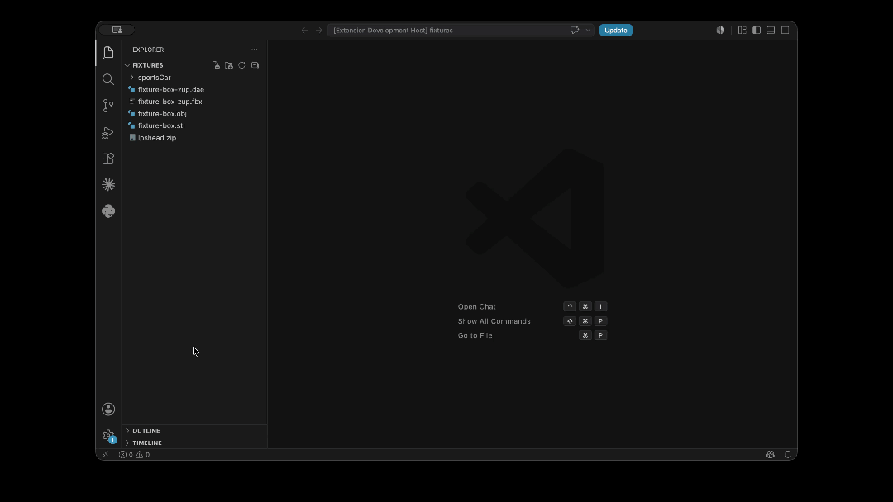

# Renderit 3D Viewer

View glTF/GLB, OBJ, FBX, STL, and Collada models directly inside VS Code - single-click open, zip/folder import, real-time lighting, no separate app.

## Features

- **Single/double-click open** — `.gltf`, `.glb`, `.obj`, `.fbx`, `.stl`, and `.dae` files open directly in a Renderit tab, no import dialog, no extra step.
- **Right-click "Open with Renderit"** on a `.zip` file or a folder in the Explorer, with automatic texture resolution whether files are flat or organized into subfolders.
- **Orbit, zoom, and reset** — click-drag to orbit with damping, scroll/pinch to zoom, idle auto-rotate before you interact, one-click reset to the framed view.
- **Day/Night lighting** and **Studio/HDRI background** — real image-based lighting, not flat directional lights.
- **Scale and rotation controls** for correcting formats (OBJ, STL) with no reliable up-axis metadata.
- **Metadata panel** — file size, format, triangle/vertex counts, mesh/material/texture counts, bounding-box dimensions.
- **State persists** across tab switches — camera position, scale, rotation, lighting, and background survive switching to another tab and back.

## In action

**Open a zip archive** — right-click a zip containing a model and its textures, choose **Open with Renderit**; textures resolve automatically whether they're flat or nested in subfolders.

**Open a folder** — right-click a folder containing a model and its textures, choose **Open with Renderit**; textures resolve automatically whether they're flat or nested in subfolders.

**Open a single file** — double-click (or single-click) any supported file in the Explorer; it opens straight into a Renderit tab, no dialog.

## Supported formats

| Format | Extension | Notes |
|---|---|---|
| glTF / GLB | `.gltf`, `.glb` | Full support, including embedded and external buffers/textures |
| Wavefront OBJ | `.obj` | Companion `.mtl` resolved automatically when present |
| Autodesk FBX | `.fbx` | |
| STL | `.stl` | Geometry only — STL has no material/color data |
| Collada | `.dae` | |
| Zip archive | `.zip` | Any of the above, plus textures, flat or in subfolders |
| Folder | — | Same resolution as zip, for an already-unpacked export |

## Commands

Renderit has no command-palette commands — it works entirely through the Explorer:

- **Single/double-click** a supported file — opens directly in the Renderit viewer (registered as the default editor for `.gltf`/`.glb`/`.obj`/`.fbx`/`.stl`/`.dae`).
- **Right-click** a `.zip` file or a folder → **Open with Renderit** — for a model packaged together with its textures.

Once a model is open, the sidebar has Scale and Rotation X/Y/Z sliders, a Day/Night lighting toggle, a Studio/HDRI background toggle, Reset view, and a Metadata panel.

## Requirements

VS Code 1.57.0 or later. No other setup — the extension bundles everything it needs.

## Known limitations

- No progress indicator while a large model is being decompressed/parsed — for a big zip or folder, the viewport can appear idle for a few seconds before the model appears.
- Materials with no embedded texture can pick up unexpected reflections from the active lighting preset's HDRI environment — this is a real rendering behavior (untextured materials reflect the current environment map), not a bug in file parsing, but it can look surprising on models that rely on flat/placeholder materials.
- Doesn't yet survive a full VS Code window restart — state persistence (above) covers switching tabs within the same session, not reopening VS Code from scratch.

## Release notes

See [CHANGELOG.md](CHANGELOG.md).

## Credits

- [Visual Studio Code](https://code.visualstudio.com/)
- [Three.js](https://threejs.org)

## License

[MIT](LICENSE)
